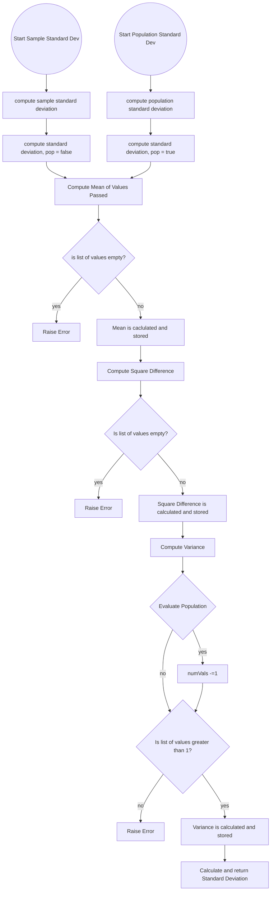

# swe3643-fall2024-homework
## Luciana Hill

- HW1: created git repo and modified read me!
- HW2: created flowchart for standard dev calculator

```mermaid
  flowchart TD
    startSam((Start Sample Standard Dev))
    startPop((Start Population Standard Dev))
    main1[compute sample standard deviation]
    main2[compute population standard deviation]
    listEmptyMean{if List Empty}  
    sampleSD[compute standard deviation, pop = false]
    meanErr[Raise Error]
    computeMean[Compute Mean of Values Passed]
    computeVariance[Compute Variance]
    computeSqDiff[Compute Square Difference]
    
    startSam-->main1-->sampleSD-->computeMean
    startPop-->main2-->popSD[compute standard deviation, pop = true] --> computeMean
    
    computeMean-->listEmptyMean{is list of values empty?}-->|no|calcMean[Mean is caclulated and stored]
    listEmptyMean-->|yes|meanErr

    calcMean-->computeSqDiff-->listEmptyDiff{Is list of values empty?}
    listEmptyDiff-->|yes|sqDiffErr[Raise Error]
    listEmptyDiff-->|no|calcSqDiff[Square Difference is calculated and stored]
    
    calcSqDiff-->computeVariance-->isPop{Evaluate Population}
    isPop-->|no|listSize
    isPop-->|yes|subtract[numVals -=1]-->listSize
    listSize{Is list of values greater than 1?}
    listSize-->|no|varErr[Raise Error]
    listSize-->|yes|calcVar[Variance is calculated and stored]

    calcVar-->calcStDv[Calculate and return Standard Deviation]
    
```
